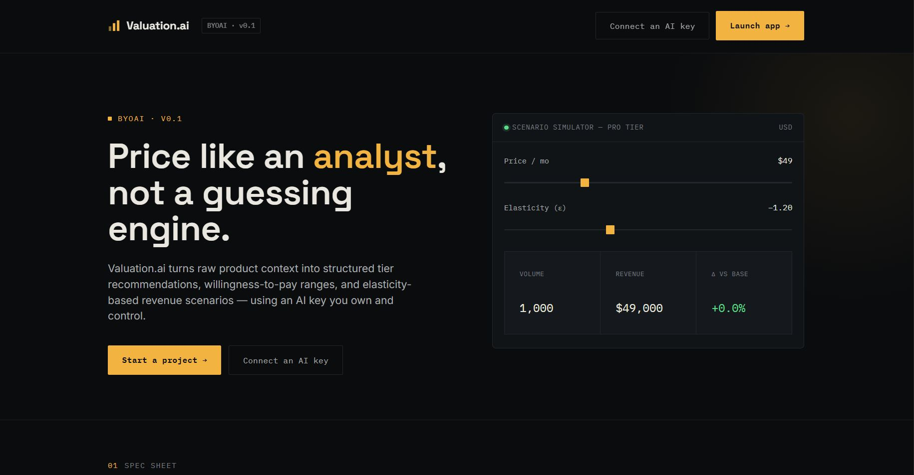
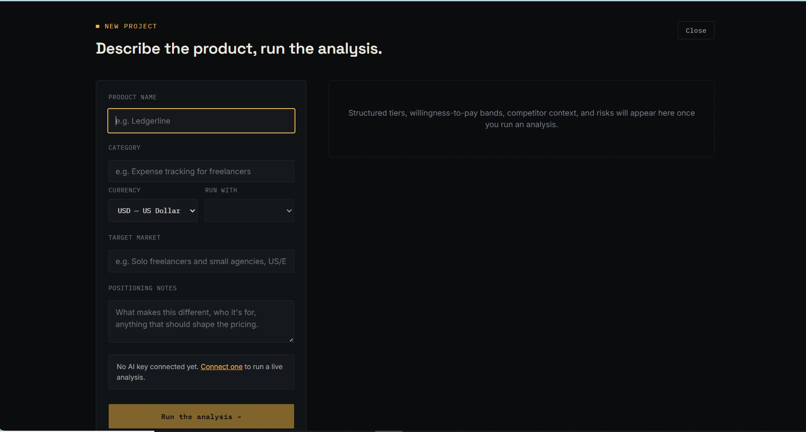
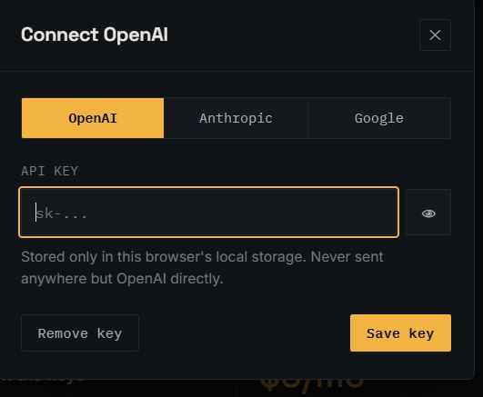

# Valuation.ai

An AI-powered pricing strategy assistant that helps founders, startups, and businesses generate pricing recommendations, market positioning, and valuation insights using a Bring Your Own AI (BYOAI) architecture.

## Features

- AI-powered pricing strategy generation
- Product valuation and positioning assistance
- Target market analysis
- Product tagline generation
- BYOAI (Bring Your Own AI) architecture
- Supports OpenAI, Anthropic, and Google AI
- Clean and responsive user interface

## Technologies

- HTML
- CSS
- JavaScript
- BYOAI Architecture
- OpenAI API
- Anthropic API
- Google AI API

## Screenshots

### Home

### Project Setup

### AI Providers

### Stop Pricing by Vibes

## Note

This project follows a Bring Your Own AI (BYOAI) approach. Users connect their own OpenAI, Anthropic, or Google AI API key to generate live pricing strategies and valuation insights.
